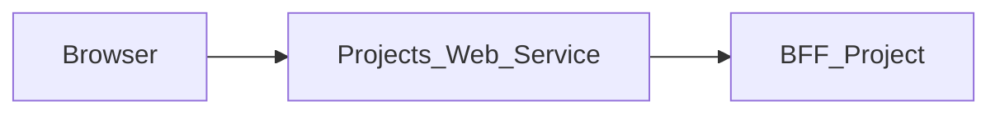

# Projects_Web_Service — Technical documentation

[Module overview](module.md) · [Français](../fr/technical.md) · [README](../../README.md)

## Architecture and request handling

Next.js 15.5.25, React 19 and TypeScript application using the App Router. The browser calls same-origin routes; the Next.js server forwards data to **BFF_Project**.



`src/app/page.tsx` orchestrates views and forms. `bffProjectClient.ts` adapts the contract to the presentation model; `projectPageState.ts` centralizes page-state updates. Components in `src/components/project` implement forms and details.

The generic proxy reads the versioned OpenAPI contract to allow paths and methods. It preserves query parameters, binary bodies, statuses and useful headers, filters transport headers, disables caching and does not automatically follow redirects. Its timeout is 15 seconds.

## Data and persistence

The following sources and limitations describe the associated BFF, which determines persistence for the displayed data.

The module combines Project API and PostgreSQL. The SQL repository handles visibility, membership, projects, tasks and collaboration. Comments and some history use `tasks.custom_fields`; status history can come from `task_history`. With `PROJECT_DB_ACCESS=disabled`, collaboration uses an in-memory fallback lost on restart.

Disabling SQL access changes capabilities and persistence; that mode does not validate a full deployment. Public identifiers and statuses are normalized by helpers, while some project fields are derived from tasks.

React state manages display and pending operations. This repository defines no business database of its own; save guarantees come from the BFF and its sources described above.

## Installation and local startup

Use Node.js 22 to reproduce the contract job and npm with the committed lockfile. Other job and Docker versions are detailed below.

Private `@mairie360/*` dependencies require GitHub Packages access. Set `NODE_AUTH_TOKEN` in the environment to a token allowed to read these packages, as configured in `.npmrc`. Do not commit its value.

```bash
npm ci
```

Create `.env.local` in the repository root. Example for BFFs running on the same machine:

```dotenv
BFF_PROJECT_BASE_URL=http://localhost:4001
```

Start BFF_Project (it resolves sessions with BFF User itself), then start the web service. Port `5001` below is an explicit local choice to avoid collisions; it is not a claim about ports in every Compose file.

```bash
npm run dev -- --port 5001
```

Open `http://localhost:5001`. To run the build with the Next.js script:

```bash
npm run build
npm run start -- --port 5001
```

## Configuration

Values below are local examples or explicitly described behavior, not production credentials.

| Variable or precedence | Example / stated fallback | Purpose |
| --- | --- | --- |
| `BFF_PROJECT_BASE_URL` → `PROJECT_BFF_URL` → `NEXT_PUBLIC_BFF_PROJECT_BASE_URL` | http://localhost:4001 | Left-to-right proxy precedence; the URL shown is the local fallback. |
| `COOKIE_DOMAIN` | — | Cookie domain; keep it consistent with Login; the local logout clears the cookie on this domain. |
| `ADMINISTRATION_FRONT_URL` | — | Navigation destination; see the source file that reads it. Variables injected by `next.config.ts` or prefixed `NEXT_PUBLIC_` are public and consumed at build time. |
| `CALENDAR_FRONT_URL` | — | Navigation destination; see the source file that reads it. Variables injected by `next.config.ts` or prefixed `NEXT_PUBLIC_` are public and consumed at build time. |
| `ELEARNING_FRONT_URL` | — | Navigation destination; see the source file that reads it. Variables injected by `next.config.ts` or prefixed `NEXT_PUBLIC_` are public and consumed at build time. |
| `EMAIL_FRONT_URL` | — | Navigation destination; see the source file that reads it. Variables injected by `next.config.ts` or prefixed `NEXT_PUBLIC_` are public and consumed at build time. |
| `FILES_FRONT_URL` | — | Navigation destination; see the source file that reads it. Variables injected by `next.config.ts` or prefixed `NEXT_PUBLIC_` are public and consumed at build time. |
| `LOGIN_FRONT_URL` | — | Navigation destination; see the source file that reads it. Variables injected by `next.config.ts` or prefixed `NEXT_PUBLIC_` are public and consumed at build time. |
| `MESSAGE_FRONT_URL` | — | Navigation destination; see the source file that reads it. Variables injected by `next.config.ts` or prefixed `NEXT_PUBLIC_` are public and consumed at build time. |
| `PROJECT_FRONT_URL` | — | Navigation destination; see the source file that reads it. Variables injected by `next.config.ts` or prefixed `NEXT_PUBLIC_` are public and consumed at build time. |

Inside a container, `localhost` refers to that container. Use the BFF service DNS name on the Docker network or a reachable host address. Compose files sometimes include other services and legacy settings; check effective URLs and ports before using them.

## Routes and data contract

Inventory extracted from `contracts/openapi.json`, the exact rebuild of the published `@mairie360/bff-project-openapi` package pinned in `package.json`. Replace brace parameters with real identifiers. Detailed types and required fields are defined in that contract. The orval package only types successes (`2XX`); BFF_Project errors use the `ApiError` envelope (`{ error: { code, message, details } }`).

These data paths are exposed at the same origin through the proxy; Next.js pages are separate. `/openapi.json` and `/swagger.json` are also forwarded. Open the `/docs` Swagger UI directly on the BFF.

| Method | Path | Declared body | Declared statuses |
| --- | --- | --- | --- |
| GET | `/check_apis` | — | 2XX |
| GET | `/health` | — | 2XX |
| POST | `/projects` | application/json | 400, 2XX |
| GET | `/projects-page` | — | 500, 2XX |
| DELETE | `/projects/{projectId}` | — | 404, 2XX |
| GET | `/projects/{projectId}` | — | 404, 2XX |
| PATCH | `/projects/{projectId}` | application/json | 400, 404, 2XX |
| PATCH | `/projects/{projectId}/close` | application/json | 403, 2XX |
| POST | `/projects/{projectId}/duplicate` | — | 404, 2XX |
| POST | `/projects/{projectId}/tasks` | application/json | 400, 404, 2XX |
| DELETE | `/projects/{projectId}/tasks/{taskId}` | — | 404, 2XX |
| PATCH | `/projects/{projectId}/tasks/{taskId}` | application/json | 400, 404, 2XX |
| GET | `/projects/{projectId}/tasks/{taskId}/collaboration` | — | 403, 2XX |
| POST | `/projects/{projectId}/tasks/{taskId}/comments` | application/json | 403, 2XX |
| PATCH | `/projects/{projectId}/tasks/{taskId}/status` | application/json | 400, 404, 2XX |

### Pages and local route

| Page | Source |
| --- | --- |
| `/` | [src/app/page.tsx](../../src/app/page.tsx) |
| `/profile` | [src/app/profile/page.tsx](../../src/app/profile/page.tsx) |

| Method | Local route | Source |
| --- | --- | --- |
| POST | `/api/auth/logout` | [src/app/api/auth/logout/route.ts](../../src/app/api/auth/logout/route.ts) |

## Session, permissions and errors

BFF_Project is the only service this web service calls; BFF_Project resolves the user with BFF User itself. The shell's role comes from the `access` block of `GET /projects-page` (the published contract exposes no name or e-mail, so the header shows the role label). `/api/auth/logout` is local: it clears the `accessToken` cookie without calling any service, so the session is not revoked server-side, because the published contract has no logout route. The generic proxy uses an explicit Bearer header or, when absent, the `accessToken` cookie. Business permissions remain those of the BFF and its sources.

The generic proxy returns 400 for an invalid path, 404 for a path outside the contract, 405 for a disallowed method and 502 when the service is unreachable or times out. Upstream responses are preserved, including empty 204/205/304 bodies.

Every response carries `X-Frame-Options: DENY`, `X-Content-Type-Options: nosniff`, `Referrer-Policy`, `Permissions-Policy` and `Cross-Origin-Resource-Policy`, `Cross-Origin-Embedder-Policy` and `Cross-Origin-Opener-Policy` (`next.config.ts`), and `X-Powered-By` is disabled. For authenticated requests, [src/middleware.ts](../../src/middleware.ts) adds a `Content-Security-Policy` with a per-request nonce, which Next.js applies to its scripts. Pages are therefore rendered on demand (`dynamic = "force-dynamic"` in the layout). Stylesheets are limited to the origin and the nonce; only `style` attributes rendered by components are allowed through `style-src-attr 'unsafe-inline'`, and `next dev` also allows `'unsafe-eval'`. Any new external resource (image, font, API called from the browser) must be added to the policy in `src/lib/content-security-policy.ts`.

## Synchronization and verification

The contract comes from a **published** BFF_Project release. After a release, pin the new version (`npm install --save-exact @mairie360/bff-project-openapi@X.Y.Z`, never a `0.0.0-dev`/`staging` pre-release), move the `bff-project` image tags in `docker-compose*.yml` to the same version, then run:

```bash
npm run contracts:sync
npm run contracts:check
npm run test:contracts
npm run lint
npm run build
```

`contracts:sync` rebuilds `contracts/openapi.json` from the installed package (`scripts/orval-contract.mjs`). `contracts:check` fails if the version is not an exact `X.Y.Z`, if the installed package differs, if another `bff-*-openapi` package exists or if the snapshot is stale. Both run offline. Types are imported from `@mairie360/bff-project-openapi/model`. `test:contracts` runs the Node tests without coverage; `npm test` runs them with the 60% threshold (lines, branches, functions) on the loaded `src/**/*.ts` modules, source-mapped to the TypeScript lines.

The tests follow the BFFs' contract-driven mocks: `tests/support/contract-mock-server.ts` and `openapi-contract.ts` are verbatim copies of the BFF helpers. A single real local HTTP server stands in for BFF_Project, driven by `contracts/openapi.json`; it rejects any path, method, parameter or body outside the contract and validates mocked responses. `tests/support/front-harness.cjs` routes the browser's same-origin `fetch` to the real `src/app/**/route.ts` handlers and only lets the server-side proxy reach that mock. `tests/network-contract.test.cjs` statically inventories every network call in `src/` and fails if one bypasses `requestBff` or the contract. `tests/package-contract.test.cjs` checks the exact pin, the single contract package, the snapshot and the Docker image tags.

For documentation-only changes, check links, accuracy in both languages and `git diff --check`; do not regenerate contracts without changing their source.

## CI/CD and Docker execution

The `contracts.yml` job uses Node.js 22, `actions/checkout@v7` and `actions/setup-node@v7`. It runs on pushes, pull requests and manual dispatch; it installs with `npm ci`, checks contracts and runs the associated tests.

`cicd.yml` calls `mairie360/CICD/.github/workflows/frontend-cicd.yml@v2.0.0`, with `cicd_version: v2.0.0` and `node_version: "23"`. Reusable steps and GitHub environments determine actual checks, publications and deployments.

The Dockerfile defaults to `NODE_VERSION=23.10.0` and the Next.js `standalone` build; the image command is `["node", "server.js"]`. Image ports and Compose mappings can differ from the local port suggested above.

Before running Docker, check service variables, build secrets and networks in the repository files. Green CI validates its jobs; it does not prove business-service availability in a remote environment.

## Troubleshooting

If the role or user context fails, check `GET /projects-page` on BFF_Project (and, behind it, BFF User). If views disagree, compare the BFF Project response, its permissions and conversions in `bffProjectClient.ts`. SQL mode and the in-memory fallback are configured in BFF Project, not in this web service.

For a proxy error, compare the path and method with the inventory, then check the BFF URL and session. For a 401 after navigating between modules, check the `accessToken` cookie, its domain and BFF_Project. A 404 for a requirement described in `BACKEND.md` may refer to a feature that is only proposed.

## Repository reference

- [src/app/page.tsx](../../src/app/page.tsx)
- [src/lib/bffProjectClient.ts](../../src/lib/bffProjectClient.ts)
- [src/lib/projectPageState.ts](../../src/lib/projectPageState.ts)
- [src/components/project](../../src/components/project)
- [src/middleware.ts](../../src/middleware.ts)
- [src/lib/bff-proxy.ts](../../src/lib/bff-proxy.ts)
- [src/app/[...path]/route.ts](../../src/app/%5B...path%5D/route.ts)
- [contracts/openapi.json](../../contracts/openapi.json)
- [scripts/orval-contract.mjs](../../scripts/orval-contract.mjs)
- [scripts/contracts.mjs](../../scripts/contracts.mjs)
- [package.json](../../package.json)
- [.github/workflows/contracts.yml](../../.github/workflows/contracts.yml)
- [.github/workflows/cicd.yml](../../.github/workflows/cicd.yml)
- [Dockerfile](../../Dockerfile)
- [docker-compose.yml](../../docker-compose.yml)

Historical supplements: [BFF.md](../../BFF.md), [BACKEND.md](../../BACKEND.md). Proposed requirements must remain distinct from implemented behavior.
