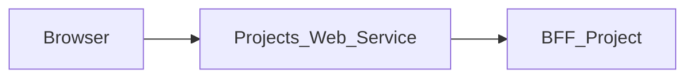

# Projects_Web_Service — Documentation technique

## Menu des modules actifs — lot préparatoire MAIR-180

Seule la liste transmise à Sidebar exclut `emails` et `files` ; la résolution des
URL existantes, la configuration, les sessions et les appels BFF sont inchangés.
Ordinateur et mobile utilisent la même liste active. Le test de page rend le
vrai Sidebar, vérifie ordre/sélection/visibilité admin, ouvre le menu mobile puis
suit Paramètres en refermant le panneau. Aucune copie de bibliothèque ni nouvelle
dépendance ; la migration AppShell MAIR-179/MAIR-180 reste distincte et incomplète.

## Profil centralisé dans Settings — lot MAIR-180

La route serveur `/profile/[[...path]]` remplace les écrans de profil locaux.
Elle redirige temporairement (307) vers `SETTINGS_FRONT_URL`, lue à chaque
requête ; aucun profil métier n'est chargé dans ce module. Une destination
absente, invalide, avec identifiants intégrés ou contenant un segment `profile`
affiche un état d'indisponibilité avec un lien de retour au module. Les paramètres
de l'ancien favori ne sont pas transmis. L'authentification middleware reste
inchangée. Aucun nouveau contrat, paquet, secret ou variable n'est ajouté.
Ce lot ne termine pas la migration complète vers l'AppShell partagé (MAIR-179).

## Destinations frontend explicites (MAIR-177)

Les redirections utilisent uniquement des URL HTTP(S) configurées, sans
identifiants intégrés. Aucun repli implicite vers localhost. Renseigner à
l’exécution les variables existantes `LOGIN_FRONT_URL` (fronts protégés) et
`PROJECT_FRONT_URL` (destination par défaut de Login), même en local. Login
accepte toujours un retour vers un front autorisé si sa destination par défaut
manque. Sans destination Login valide, le middleware répond 503 sans cache ;
Login affiche un état indisponible sans formulaire si aucune destination ne
peut être résolue. Aucun contrat API/BFF ni variable de déploiement ajouté.


[Présentation du module](module.md) · [English](../en/technical.md) · [README](../../README.md)

## Architecture et traitement des requêtes

Application Next.js 15.5.25, React 19 et TypeScript avec App Router. Le navigateur appelle les routes de la même origine; le serveur Next.js relaie les données vers **BFF_Project**.



`src/app/page.tsx` orchestre vues et formulaires. `bffProjectClient.ts` adapte le contrat au modèle de présentation; `projectPageState.ts` centralise la mise à jour de l’état de page. Les composants du dossier `src/components/project` portent les formulaires et détails.

Le proxy générique lit le contrat OpenAPI versionné pour autoriser chemins et méthodes. Il conserve paramètres de requête, corps binaire, statuts et en-têtes utiles, filtre les en-têtes de transport, désactive le cache et n’effectue pas de suivi automatique des redirections. Son délai est de 15 secondes.

## Données et persistance

Les sources et limites suivantes concernent le BFF associé, dont dépend la sauvegarde des données affichées.

Le module combine Project API et PostgreSQL. Le dépôt SQL gère notamment visibilité, membres, projets, tâches et collaboration. Les commentaires et une partie de l’historique utilisent `tasks.custom_fields`; l’historique de statut peut venir de `task_history`. Avec `PROJECT_DB_ACCESS=disabled`, la collaboration utilise un repli mémoire perdu au redémarrage.

Désactiver l’accès SQL change les capacités et la persistance; ce mode ne constitue pas une validation d’un déploiement complet. Les identifiants publics et statuts sont normalisés par les helpers, tandis que certains champs de projet sont dérivés des tâches.

L’état React gère l’affichage et les opérations en cours. Ce dépôt ne définit pas de base métier propre; les garanties de sauvegarde sont celles du BFF et de ses sources décrites ci-dessus.

## Installation et lancement local

Utiliser Node.js 22 pour reproduire le job de contrats et npm avec le fichier de verrouillage versionné. Les versions des autres jobs et de Docker sont précisées plus bas.

Les dépendances privées `@mairie360/*` nécessitent un accès GitHub Packages. Configurer `NODE_AUTH_TOKEN` dans l’environnement avec un jeton autorisé à lire ces packages, conformément à `.npmrc`. Ne pas enregistrer la valeur dans Git.

```bash
npm ci
```

Créer `.env.local` à la racine. Exemple pour des BFF exécutés sur la même machine:

```dotenv
BFF_PROJECT_BASE_URL=http://localhost:4001
```

Démarrer BFF_Project (il résout lui-même la session auprès de BFF User), puis lancer le web service. Le port `5001` ci-dessous est un choix local explicite pour éviter les collisions; ce n’est pas une affirmation sur les ports de tous les fichiers Compose.

```bash
npm run dev -- --port 5001
```

Ouvrir `http://localhost:5001`. Pour exécuter le build avec le script Next.js:

```bash
npm run build
npm run start -- --port 5001
```

## Configuration

Si la session manque ou a expiré, le middleware transmet `redirect` à Login. Il construit la destination avec `PROJECT_FRONT_URL` lu à l’exécution, puis le chemin et la query demandés, jamais avec l’hôte interne de l’ingress. Sans URL publique valide, Login utilise sa destination Projets par défaut.

Les valeurs ci-dessous sont des exemples locaux ou des comportements explicitement indiqués, pas des identifiants de production.

| Variable ou priorité | Exemple / repli indiqué | Rôle |
| --- | --- | --- |
| `BFF_PROJECT_BASE_URL` → `PROJECT_BFF_URL` → `NEXT_PUBLIC_BFF_PROJECT_BASE_URL` | http://localhost:4001 | Priorité de gauche à droite dans le proxy ; configurer explicitement une URL HTTP(S). Une configuration absente ou invalide renvoie un 503 non mis en cache, sans appel réseau. |
| `COOKIE_DOMAIN` | — | Domaine des cookies; vérifier sa cohérence avec Login ; la déconnexion locale efface le cookie sur ce domaine. |
| `ADMINISTRATION_FRONT_URL` | — | Destination de navigation; voir le fichier source qui la lit. Les variables injectées par `next.config.ts` ou préfixées `NEXT_PUBLIC_` sont publiques et prises en compte lors du build. |
| `CALENDAR_FRONT_URL` | — | Destination de navigation; voir le fichier source qui la lit. Les variables injectées par `next.config.ts` ou préfixées `NEXT_PUBLIC_` sont publiques et prises en compte lors du build. |
| `ELEARNING_FRONT_URL` | — | Destination de navigation; voir le fichier source qui la lit. Les variables injectées par `next.config.ts` ou préfixées `NEXT_PUBLIC_` sont publiques et prises en compte lors du build. |
| `EMAIL_FRONT_URL` | — | Destination de navigation; voir le fichier source qui la lit. Les variables injectées par `next.config.ts` ou préfixées `NEXT_PUBLIC_` sont publiques et prises en compte lors du build. |
| `FILES_FRONT_URL` | — | Destination de navigation; voir le fichier source qui la lit. Les variables injectées par `next.config.ts` ou préfixées `NEXT_PUBLIC_` sont publiques et prises en compte lors du build. |
| `LOGIN_FRONT_URL` | — | Destination de navigation; voir le fichier source qui la lit. Les variables injectées par `next.config.ts` ou préfixées `NEXT_PUBLIC_` sont publiques et prises en compte lors du build. |
| `MESSAGE_FRONT_URL` | — | Destination de navigation; voir le fichier source qui la lit. Les variables injectées par `next.config.ts` ou préfixées `NEXT_PUBLIC_` sont publiques et prises en compte lors du build. |
| `PROJECT_FRONT_URL` | — | Destination de navigation; voir le fichier source qui la lit. Les variables injectées par `next.config.ts` ou préfixées `NEXT_PUBLIC_` sont publiques et prises en compte lors du build. |

Dans un conteneur, `localhost` désigne le conteneur lui-même. Utiliser le nom DNS du service BFF sur le réseau Docker, ou une adresse d’hôte accessible. Les fichiers Compose incluent parfois d’autres services et des paramètres hérités; vérifier les URL et ports effectifs avant de les employer.

## Routes et contrat de données

Inventaire extrait de `contracts/openapi.json`, reconstruction exacte du paquet publié `@mairie360/bff-project-openapi` épinglé dans `package.json`. Les paramètres entre accolades sont remplacés par des identifiants réels. Les types détaillés et champs requis sont définis dans ce contrat. Le paquet orval ne type que les succès (`2XX`) ; les erreurs de BFF_Project utilisent l’enveloppe `ApiError` (`{ error: { code, message, details } }`).

Ces chemins de données sont exposés à la même origine par le proxy; les pages Next.js sont distinctes. `/openapi.json` et `/swagger.json` sont également relayés. L’interface Swagger `/docs` se consulte directement sur le BFF.

| Méthode | Chemin | Corps déclaré | Statuts déclarés |
| --- | --- | --- | --- |
| GET | `/check_apis` | — | 2XX |
| GET | `/health` | — | 2XX |
| POST | `/projects` | application/json | 400, 2XX |
| GET | `/projects-page` | — | 500, 2XX |
| DELETE | `/projects/{projectId}` | — | 404, 2XX |
| GET | `/projects/{projectId}` | — | 404, 2XX |
| PATCH | `/projects/{projectId}` | application/json | 400, 404, 2XX |
| PATCH | `/projects/{projectId}/close` | application/json | 403, 2XX |
| POST | `/projects/{projectId}/duplicate` | — | 404, 2XX |
| POST | `/projects/{projectId}/tasks` | application/json | 400, 404, 2XX |
| DELETE | `/projects/{projectId}/tasks/{taskId}` | — | 404, 2XX |
| PATCH | `/projects/{projectId}/tasks/{taskId}` | application/json | 400, 404, 2XX |
| GET | `/projects/{projectId}/tasks/{taskId}/collaboration` | — | 403, 2XX |
| POST | `/projects/{projectId}/tasks/{taskId}/comments` | application/json | 403, 2XX |
| PATCH | `/projects/{projectId}/tasks/{taskId}/status` | application/json | 400, 404, 2XX |

### Pages et route locale

| Page | Source |
| --- | --- |
| `/` | [src/app/page.tsx](../../src/app/page.tsx) |
| `/profile/[[...path]]` | [src/app/profile/[[...path]]/page.tsx](../../src/app/profile/%5B%5B...path%5D%5D/page.tsx) |

| Méthode | Route locale | Source |
| --- | --- | --- |
| POST | `/api/auth/logout` | [src/app/api/auth/logout/route.ts](../../src/app/api/auth/logout/route.ts) |

## Session, permissions et erreurs

BFF_Project est le seul service appelé par ce web service ; c’est lui qui résout l’utilisateur auprès de BFF User. Le rôle affiché par le shell vient du bloc `access` de `GET /projects-page` (le contrat publié n’expose ni nom ni e-mail, l’en-tête affiche donc le libellé du rôle). `/api/auth/logout` est local : il efface le cookie `accessToken` sans appeler de service, la session n’est donc pas révoquée côté serveur, faute de route de déconnexion dans le contrat publié. Le proxy générique utilise le Bearer explicite ou, en son absence, le cookie `accessToken`. Les permissions métier restent celles du BFF et de ses sources.

Le proxy générique répond 400 pour un chemin invalide, 404 pour un chemin hors contrat, 405 pour une méthode interdite et 502 si le service est injoignable ou dépasse le délai. Les réponses amont sont conservées, y compris les corps vides 204/205/304.

Toutes les réponses portent `X-Frame-Options: DENY`, `X-Content-Type-Options: nosniff`, `Referrer-Policy`, `Permissions-Policy` et `Cross-Origin-Resource-Policy`, `Cross-Origin-Embedder-Policy` et `Cross-Origin-Opener-Policy` (`next.config.ts`), et `X-Powered-By` est désactivé. Pour les requêtes authentifiées, [src/middleware.ts](../../src/middleware.ts) ajoute une `Content-Security-Policy` avec un nonce propre à chaque requête, que Next.js applique à ses scripts. Les pages sont donc rendues à la demande (`dynamic = "force-dynamic"` dans le layout). Les feuilles de style sont limitées à l'origine et au nonce ; seuls les attributs `style` rendus par les composants passent par `style-src-attr 'unsafe-inline'`, et `next dev` autorise aussi `'unsafe-eval'`. Toute nouvelle ressource externe (image, police, API appelée depuis le navigateur) doit être ajoutée à la politique dans `src/lib/content-security-policy.ts`.

## Synchronisation et vérifications

Le contrat provient d’une version **publiée** de BFF_Project. Après une publication, épingler la nouvelle version (`npm install --save-exact @mairie360/bff-project-openapi@X.Y.Z`, jamais une préversion `0.0.0-dev`/`staging`), aligner les tags d’image `bff-project` des `docker-compose*.yml` sur cette version, puis exécuter :

```bash
npm run contracts:sync
npm run contracts:check
npm run test:contracts
npm run lint
npm run build
```

`contracts:sync` reconstruit `contracts/openapi.json` depuis le paquet installé (`scripts/orval-contract.mjs`). `contracts:check` échoue si la version n’est pas un `X.Y.Z` exact, si le paquet installé diffère, si un autre paquet `bff-*-openapi` existe ou si le snapshot est périmé. Les deux fonctionnent hors ligne. Les types sont importés de `@mairie360/bff-project-openapi/model`. `test:contracts` exécute les tests Node sans coverage ; `npm test` les exécute avec le seuil de 60 % (lignes, branches, fonctions) sur les modules `src/**/*.ts` chargés, rapportés aux lignes TypeScript grâce aux source maps.

Les tests reprennent les mocks pilotés par contrat des BFF : `tests/support/contract-mock-server.ts` et `openapi-contract.ts` sont des copies à l’identique des helpers des BFF. Un seul vrai serveur HTTP local simule BFF_Project, piloté par `contracts/openapi.json` ; il refuse tout chemin, méthode, paramètre ou corps hors contrat et valide les réponses simulées. `tests/support/front-harness.cjs` route le `fetch` same-origin du navigateur vers les vrais handlers `src/app/**/route.ts` et n’autorise le proxy serveur qu’à joindre ce mock. `tests/network-contract.test.cjs` inventorie statiquement chaque appel réseau de `src/` et échoue si l’un d’eux contourne `requestBff` ou le contrat. `tests/package-contract.test.cjs` vérifie l’épinglage exact, l’unicité du paquet de contrat, le snapshot et les tags d’image Docker.

Pour une modification uniquement documentaire, vérifier les liens, l’exactitude des deux langues et `git diff --check`; ne pas régénérer les contrats sans modification de leur source.

## CI/CD et exécution Docker

Le job `contracts.yml` utilise Node.js 22, `actions/checkout@v7` et `actions/setup-node@v7`. Il s’exécute sur push, pull request et lancement manuel; il installe avec `npm ci`, contrôle les contrats et lance les tests dédiés.

`cicd.yml` appelle `mairie360/CICD/.github/workflows/frontend-cicd.yml@v2.0.0`, avec `cicd_version: v2.0.0` et `node_version: "23"`. Les étapes réutilisables et les environnements GitHub déterminent les contrôles, publications et déploiements effectifs.

Le Dockerfile utilise par défaut `NODE_VERSION=23.10.0` et le build Next.js `standalone`; la commande de l’image est `["node", "server.js"]`. Le port de l’image et les mappings Compose peuvent différer du port local proposé plus haut.

Avant un lancement Docker, vérifier les variables de service, les secrets de build et les réseaux dans les fichiers du dépôt. Une CI verte valide ses jobs; elle ne prouve pas la disponibilité des services métier dans un environnement distant.

## Diagnostic

Si le rôle ou le contexte utilisateur échoue, vérifier `GET /projects-page` sur BFF_Project (et, derrière lui, BFF User). Si les vues divergent, comparer la réponse de BFF Project, ses permissions et les conversions de `bffProjectClient.ts`. Le mode SQL et le repli mémoire se configurent dans BFF Project, pas dans ce web service.

En cas d’erreur de proxy, comparer la route et la méthode à l’inventaire, vérifier l’URL du BFF puis la session. Pour un 401 après navigation entre modules, vérifier le cookie `accessToken`, son domaine et BFF_Project. Un 404 sur un besoin décrit dans `BACKEND.md` peut correspondre à une fonctionnalité seulement proposée.

## Repères dans le dépôt

- [src/app/page.tsx](../../src/app/page.tsx)
- [src/lib/bffProjectClient.ts](../../src/lib/bffProjectClient.ts)
- [src/lib/projectPageState.ts](../../src/lib/projectPageState.ts)
- [src/components/project](../../src/components/project)
- [src/middleware.ts](../../src/middleware.ts)
- [src/lib/bff-proxy.ts](../../src/lib/bff-proxy.ts)
- [src/app/[...path]/route.ts](../../src/app/%5B...path%5D/route.ts)
- [contracts/openapi.json](../../contracts/openapi.json)
- [scripts/orval-contract.mjs](../../scripts/orval-contract.mjs)
- [scripts/contracts.mjs](../../scripts/contracts.mjs)
- [package.json](../../package.json)
- [.github/workflows/contracts.yml](../../.github/workflows/contracts.yml)
- [.github/workflows/cicd.yml](../../.github/workflows/cicd.yml)
- [Dockerfile](../../Dockerfile)
- [docker-compose.yml](../../docker-compose.yml)

Compléments historiques: [BFF.md](../../BFF.md), [BACKEND.md](../../BACKEND.md). Les besoins proposés doivent rester distincts du comportement effectivement implémenté.
